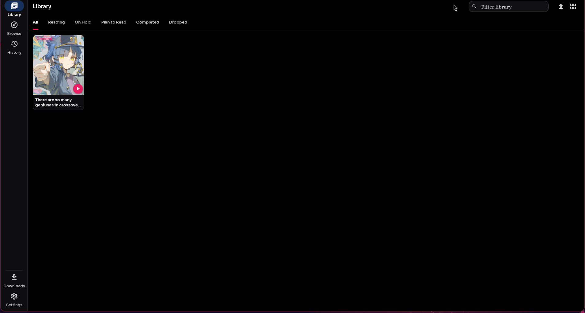
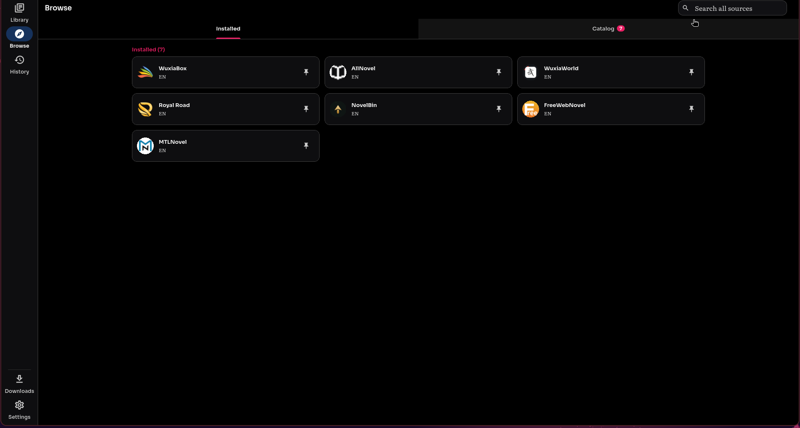
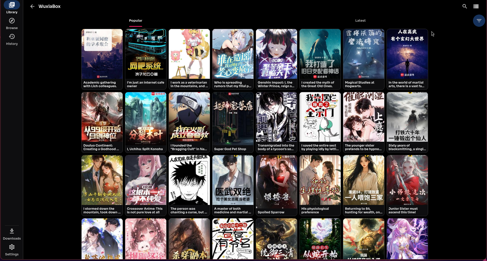
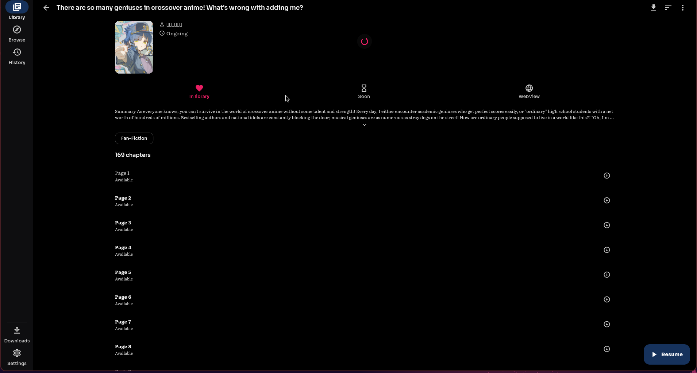
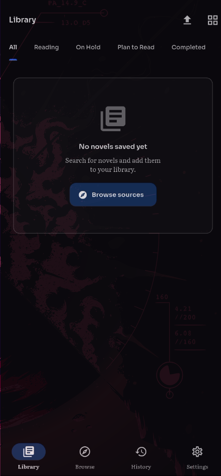
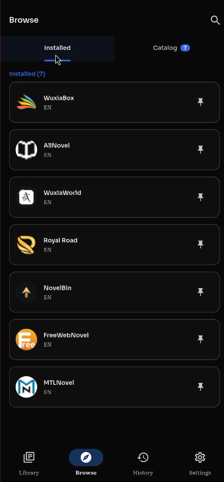
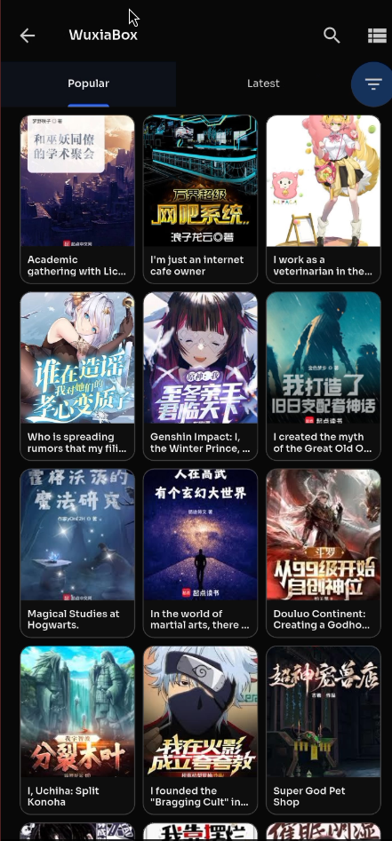
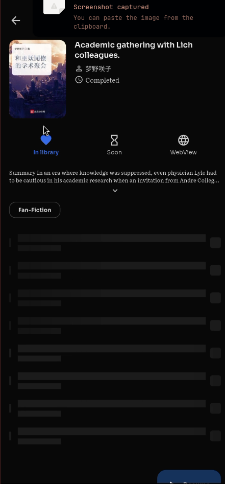

<div align="center">


# NovelDock

**Ad-free novel reader and downloader for Android and Linux desktop, built with Flutter.**

[](https://github.com/GrishMahat/NovelDock/actions/workflows/ci.yml)
[](https://github.com/GrishMahat/NovelDock/releases)
[](LICENSE)

[](CONTRIBUTING.md)

Read web novels through installable JavaScript source extensions, import your own EPUB and PDF files, or listen to your library with text-to-speech.

</div>

> NovelDock hosts nothing. It renders whatever sources you install. Novels belong to their authors and publishers; support official releases when you can.

## Who is this for?

I built this for myself first. I wanted to read novels on my laptop, and on Linux I couldn't find a good reader  the one or two apps I did find were in Chinese, which I don't read. So I wrote the app I wanted: one library, my downloads, and read-aloud, following me from laptop to phone wherever I go.

Many people read novels in a browser, and if tabs work for you, that's fine  this isn't trying to replace your browser. NovelDock is for readers who want a standalone app. On Android there are plenty of readers; on Linux desktop there are few, and none I could actually use. If that's your situation too, this app is for you.

## Screenshots

<details>
<summary>Linux desktop screenshots</summary>

<p align="center">
  <a href="docs/screenshots/desktop-library.png"></a>
  <a href="docs/screenshots/desktop-browse.png"></a>
</p>
<p align="center">
  <a href="docs/screenshots/desktop-sources.png"></a>
  <a href="docs/screenshots/desktop-novel.png"></a>
</p>

</details>

<details>
<summary>Android screenshots</summary>

<p align="center">
  <a href="docs/screenshots/mobile-library.png"></a>
  <a href="docs/screenshots/mobile-browse.png"></a>
  <a href="docs/screenshots/mobile-sources.png"></a>
  <a href="docs/screenshots/mobile-novel.png"></a>
</p>

</details>

## Features

- **Sources**: install community JS providers from the catalog, then browse, search, and download
- **Library**: status tabs (Reading, On Hold, Plan to Read, Completed, Dropped) with grid, list, and compact views
- **Reader**: continuous or paged scrolling, five themes, adjustable typography, bionic reading mode
- **Resume**: reopens at the exact paragraph you left, even after a force close
- **Text-to-speech**: read aloud with paragraph highlighting, auto-advance across chapters, background playback, media keys (MPRIS on Linux)
- **Downloads**: queue chapters for offline reading
- **Translation**: on-device chapter translation via ML Kit
- **Bookmarks and history**: bookmark any position; history follows what you actually finished
- **Import**: open local EPUB and PDF files
- **Backup and restore**: export your library and settings

## Platforms

| Platform | Status |
|----------|--------|
| Android  | Supported |
| Linux    | Supported |
| Windows / macOS / iOS | Not yet |

## Build from source

Flutter 3.38+ with Dart 3.12+.

```bash
git clone https://github.com/GrishMahat/NovelDock.git
cd NovelDock
flutter pub get
flutter run -d linux   # or: flutter build apk
```

Forked git dependencies (see below) resolve automatically during `pub get`.

## Desktop keyboard shortcuts

<details>
<summary>Click to expand</summary>


| Keys | Action |
|------|--------|
| `1` - `4` | Switch tabs (Library, Browse, History, Settings) |
| `Ctrl+D` | Downloads |
| `Ctrl+,` | Settings |
| `F5` / `Ctrl+R` | Refresh current tab |
| `Left` / `Right` (reader) | Previous / next chapter |
| `Space` (reader) | Toggle reader controls |
| `Esc` (reader) | Back |
| `Ctrl+L` (reader) | Pin the chapter panel |

</details>

## Sources

Novels come from provider registries you add in Settings > Providers. The default registry lives at [noveldock-providers](https://github.com/GrishMahat/noveldock-providers).

## Forked packages

<details>
<summary>Why some dependencies are git forks</summary>

Some Dart packages are maintained as forks and pulled as git dependencies:

- [flutter_edge_tts](https://github.com/GrishMahat/flutter_edge_tts), fork of [Moosphan/flutter_edge_tts](https://github.com/Moosphan/flutter_edge_tts). Upstream opens a new connection per synthesis request; the fork holds one persistent WebSocket instead.
- [just_audio_media_kit](https://github.com/GrishMahat/just_audio_media_kit), fork of [Pato05/just_audio_media_kit](https://github.com/Pato05/just_audio_media_kit). Adds a static `mpvProperties` map so any mpv property (network timeout, HTTP headers) applies to every player; upstream had no such hook.
- [flutter_js](https://github.com/GrishMahat/flutter_js), fork of [abner/flutter_js](https://github.com/abner/flutter_js). Runs provider scripts on quickjs-ng. Forked early on; the exact reason is lost to time, but it works and stays pinned.

</details>

## Releases

Releases are built automatically. Bump `version` in `pubspec.yaml`, commit, then:

```bash
git tag -a vX.Y.Z-beta -m "..."
git push origin vX.Y.Z-beta
```

The release workflow signs the APK with a keystore stored in GitHub secrets and publishes it under Releases with generated notes. To build locally you need `android/key.properties` pointing at your own keystore; without it, local release builds fall back to debug signing.

## Docs

- [DESIGN.md](DESIGN.md) — the design contract: accent rules, Sora/Literata type scale, spacing/radius/motion tokens, and the reader palette exemption
- [docs/WHY.md](docs/WHY.md) — why the code is built this way: the Markdown rendering pipeline vs raw HTML, and other decisions as they're made

## Credits

I built NovelDock because I wanted to read my novels on the desktop. [QuickNovel](https://github.com/LagradOst/QuickNovel) by LagradOst and contributors was the inspiration, and credit goes to that team for the idea. The app itself is an independent Flutter codebase with a different architecture, not a port.

JS runtime: forked [flutter_js](https://github.com/abner/flutter_js) running quickjs-ng.

## License

Copyright (C) 2026 Grish Mahat

NovelDock is free software: you can redistribute it and modify it under the GNU General Public License, version 3 or later. See [LICENSE](LICENSE). It ships without warranty; the license has details.

## Status

Early beta. Rough edges expected. Issues and pull requests welcome.
